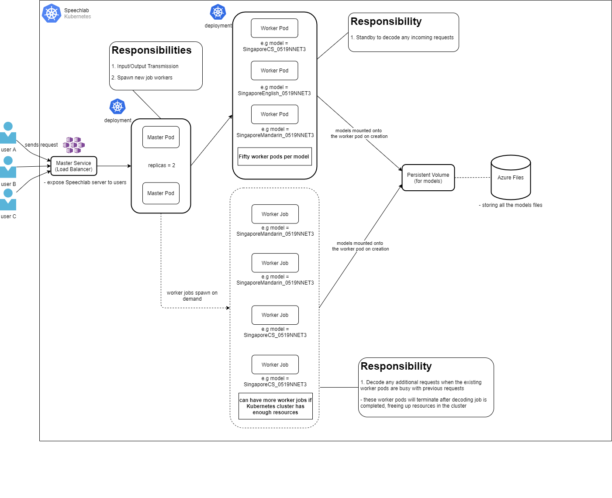

# SpeechLab - AIMS Speech Recognition System 

## Project Description

This project is supposed to use Kubernetes and Docker to create a container orchestration system that can handle incoming requests for the speech-to-text speech recognition system jointly developed by NTU and AISG. This system should be able to load balance the requests from the users and distribute the load evenly to all workers. With the aim of making the system scalable in the future, the Kubernetes setup should be able to scale according to the usage of the system. The system should be able to optimise the resources and best serve the needs of the users.

## About

This repository is meant to improve the performance of existing system and experiment with better architecture querying the speech recognition models. All the Azure resources can be deleted and regenerated via the `deploy.sh` script. 

## Prerequisites

This project uses several third party resources which can be easily installed online. 
You need the following packages locally on your development machine,

1. Docker

Follow the installation instructions here - https://docs.docker.com/install/linux/docker-ce/ubuntu/
Installation of `docker-compose` is optional, might be useful for preliminary testing of the kaldi scripts

2. Azure CLI

Follow the installation instructions here - https://docs.microsoft.com/en-us/cli/azure/install-azure-cli?view=azure-cli-latest

Sign In with your Azure account via Azure CLI `az login` - https://docs.microsoft.com/en-us/cli/azure/authenticate-azure-cli?view=azure-cli-latest
It is assumed that you have a valid Azure account with the permissions to create resources within the portal.

## Usage

1. Give execute permission to deploy.sh
`chmod +x ./deploy.sh`

2. Place the models folders e.g *SingaporeCS_0519NNET3*, *SingaporeMandarin_0519NNET3* in the `models/` directory of this project.
The `deploy.sh` script will upload these models to the Azure Files. 

3. Run the deploy script in your terminal (for Unix/Linux machines) (You need root permissions to copy the K8s config file into the Docker image)
`sudo ./deploy.sh`

The `deploy.sh` script will set up the Kuberbetes cluster, static public IP address, private docker registry, and the storage account all at once. It will also create the docker image of the kaldi image to be deployed on Helm. 

** Do note that the `deploy.sh` script works best on **Ubuntu 18.04** OS. The script might not work as intended on MacOS or Windows OS

## Architecture Design 



## Others

**secret**

Since this repository is meant to test possible improvements for the speech-to-text recognition system, the resources deployed on the Azure portal can be deleted and regenerated with the `deploy.sh` script anytime. The following files - `config`, `docker-compose-local.yaml` and `run_kubernetes_secret.yaml` in the `secret` directory are supposed to be kept secret and not be pushed to the git repository during production stage as it gives the owner of these files direct access to the Kubernetes cluster deployed on the Azure cloud. As we are only doing prototyping work here, these files are committed for future references.

# Testing Procedures

The `client_[2 or 3]_ssl.py` file allows one to connect to the server that can transcribe audio files or audio from live microphone input. The difference between the 2 scripts is that 1 script uses Python 2 while the other script uses Python 3 to run the test commands. Sample audio files are also uploaded in the `client/audio` and `docker/audio/long` folders in both English and Chinese medium for your convenience. 

## Sample commands to run

### Test Locally with Docker compose

- cd into the docker directory
- run `docker-compose up`

```bash
cd docker/

docker-compose up
```

### Test with HTTP client

- cd into the project directory

```bash
curl  -X PUT -T docker/audio/long/episode-1-introduction-and-origins.wav --header "model: SingaporeCS_0519NNET3" --header "content-type: audio/x-wav" "http://kaldi-feature-test.southeastasia.cloudapp.azure.com/client/dynamic/recognize"

```

### with Live Microphone Input

- `python client/client_2_ssl.py  -o stream  -u ws://kaldi-feature-test.southeastasia.cloudapp.azure.com/client/ws/speech  -r 32000 -t abc --model="SingaporeCS_0519NNET3"`
- `python3 client/client_3_ssl.py  -o stream  -u ws://kaldi-feature-test.southeastasia.cloudapp.azure.com/client/ws/speech  -r 32000 -t abc --model="SingaporeCS_0519NNET3"`

### with Audio File

- `python client/client_2_ssl.py -u ws://kaldi-feature-test.southeastasia.cloudapp.azure.com/client/ws/speech -r 32000 -t abc --model="SingaporeCS_0519NNET3" client/audio/episode-1-introduction-and-origins.wav`
- `python3 client/client_3_ssl.py -u ws://kaldi-feature-test.southeastasia.cloudapp.azure.com/client/ws/speech -r 32000 -t abc --model="SingaporeCS_0519NNET3" client/audio/episode-1-introduction-and-origins.wav`

### Available models

1. SgEnglish_AISG_2019
2. SingaporeCS_0519NNET3
3. SingaporeEnglish_0519NNET3
4. SingaporeMandarin_0519NNET3

to be updated when more models are available for decoding

## Oral Presentation

Link to Oral Presentation Slides - https://prezi.com/view/DPPcNricxEsAqJxwWSNT/

Link to Oral Presentation Video - https://www.youtube.com/watch?v=le79VEOjeuQ

## Authors/Contact

**WONG SENG WEE** - AUG 2019 TO APR 2020

## Acknowledgements

* relevant AISG personnel involved (Cheewei)
* Ly for her help in contacting AISG for relevant help
* Prof. Chng for telling me his expectations
* https://github.com/alumae/kaldi-gstreamer-server
* https://github.com/jcsilva/docker-kaldi-gstreamer-server
* https://github.com/wudaown/kaldi-aks
